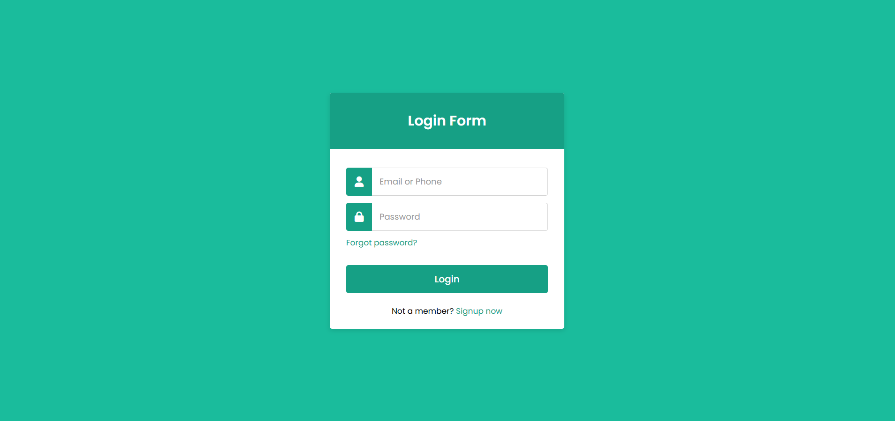

# Responsive Login Form

A modern and responsive **Login Form** built with **HTML5** and **CSS3**. This project features a clean user interface, responsive layout, and smooth interactions, making it suitable for practicing front-end development fundamentals.

## 🚀 Features

- Responsive Design
- Modern & Clean UI
- Font Awesome Icons
- Smooth Hover Effects
- Input Focus Animations
- Well-Organized Code
- Easy to Customize

## 🛠️ Built With

- HTML5
- CSS3
- Font Awesome

## 📸 Preview



## 📂 Project Structure

```
├── index.html
├── style.css
├── imag-1.png
└── README.md
```

## 💡 About

This project was created to practice building responsive login forms using modern HTML and CSS techniques while focusing on clean design and responsive layouts.

## 👨‍💻 Author

**Mohamed**